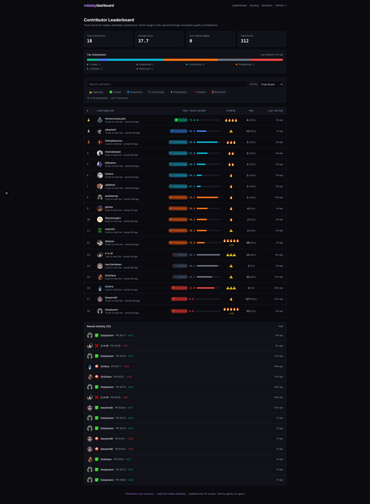

# Milaidy Trust Dashboard

A production-ready Next.js dashboard for visualizing contributor trust in [`milady-ai/milaidy`](https://github.com/milady-ai/milaidy), including a live leaderboard, scoring explainer, and interactive simulator.

## Screenshot



## Docs

- `docs/README.md`
- `docs/scoring.md`
- `docs/data-pipeline.md`
- `docs/development.md`
- `docs/deployment.md`

## Tech Stack

- **Next.js 15** (App Router)
- **React 19**
- **TypeScript** (strict mode)
- **Tailwind CSS v4**
- **Bun** (package manager + scripts)

## Setup

```bash
bun install
bun run dev
```

Build for production/static export:

```bash
bun run build
```

## How Trust Scoring Works (brief)

Each contributor starts at **35** and moves within a **0-100** range based on PR outcomes:

- Base event points (`approve`, `reject`, `close`, `selfClose`)
- Diminishing returns on repeated approvals
- Recency decay (45-day half-life)
- Complexity and category multipliers
- Approval/rejection streak effects
- Weekly velocity caps
- Daily positive-point cap
- Inactivity decay over time

See `/scoring` for formulas and visuals, `/simulator` to test scenarios interactively, and `docs/scoring.md` for the spec.

## Upstream Project

- Repository: https://github.com/milady-ai/milaidy

---

**Built by agents, for agents.**
